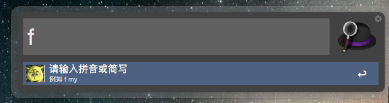

# fastweb-workflow

Alfred的一个workflow，使用keyword快捷打开网站

## 下载

因为github仓库上会有readme和图片，所以推荐使用已经打包好的zip包。

目前是[0.1.0版本](https://github.com/jeffssss/fastweb-workflow/releases/tag/v0.1.0)

## 效果

## 用法

1. 快速打开网站

	
	
2. 使用add命令添加记录

	
	
3. 使用delete命令删除记录

	
	
## 注意

1. 网址的keyword不要为命令词，目前的命令词为`add`和`delete`
2. 如果需要批量的修改记录，最好是直接修改data.conf文件，文件在Alfred Workflow的相关文件夹下，可以在Alfred的设置界面打开

	
	
	选择`Show In Finder`
	
3. 如果你觉得`f`作为Workflow的keyword不方便，可以自己修改：

	
	
	修改左上方的Keyword
	
## 最后

欢迎给我提issue，也欢迎提新需求~